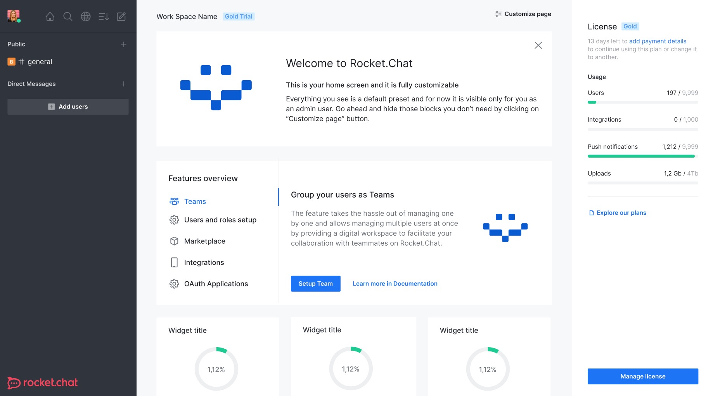

# Rocket.chat CI/CD pipeline

Deploy Rocket.chat server with CI/CD on Elestio

 
 

# Once deployed ...

You can can open Rocket.chat UI here:

    URL: https://[CI_CD_DOMAIN]
    login: [ADMIN_EMAIL]
    password: [ADMIN_PASSWORD]
